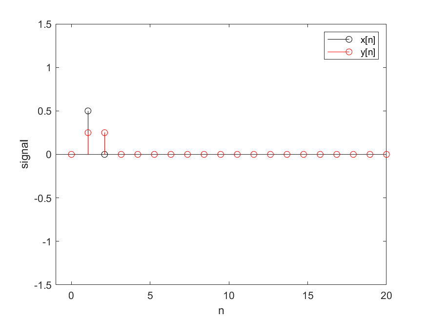

# Uppgift 1
Det låter som att de högfrekventa signalerna är bortfiltrerade

# Uppgift 2
Här verkar de lågfrekventa signalerna ha tagits bort iställets

# Uppgift 3

# uppgift 4
Utsignalen liknar den i uppgift 3 men är flyttad 1 steg år höger samt 
hälften så hög som den i uppgift 3. 

# uppgift 5
Systemet är kausalt ty det beror inte på framtida värden. dvs endast fördröjningar.
Utsignalen är en summa av utsignalerna i fråga 3 och 4. Det stämmer överens
med att systemet är ett LTI system.

# uppgift 6
Amplituden skiljer sig en del. Anledningen är att x-värden adderas med tidigare x-värden. Systemet med hög frekvens har större varians på x-värdena. Chansen är större att ett negativt värde adderas med ett positivt. Då får resultatet låg amplitud. På så sätt kan systemet ses som ett lågpassfilter.

amplituden skiljer sig del. anledningen är att de är skilda är att utsignalen 
är ett medelvärde av signalen. y2 är mindre ty det är större skillander mellan funktionsvärdena,
dvs vissa angränsande värden är negativa. Därför blir dens amplitud mycket mindre när 
man tar medelvärdet.

