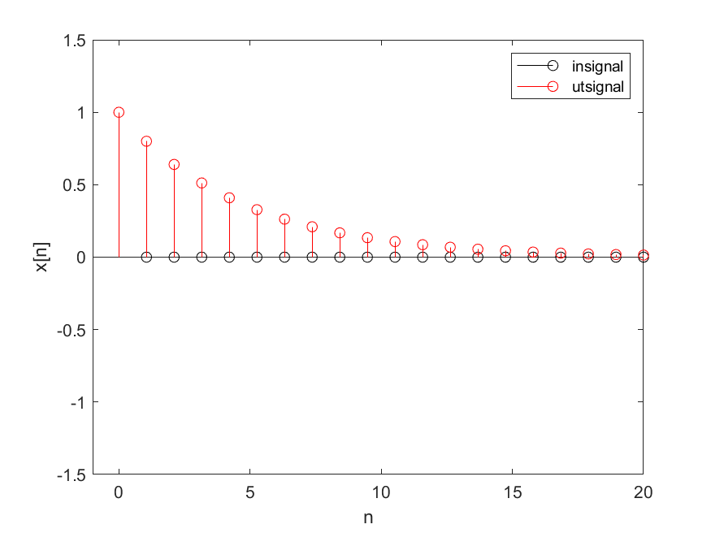

# Uppgift 7
```matlab
x = zeros(1,20);
x(1) = 1;

y = zeros(1,20);

a1 = -0.8;
N = length(x);
y(1) = x(1);

for n=2:N
    y(n) = x(n) - a1*y(n-1);
end
```

y[n] minskar med 20% varje steg, vilket är rimligt utav definitionen

#