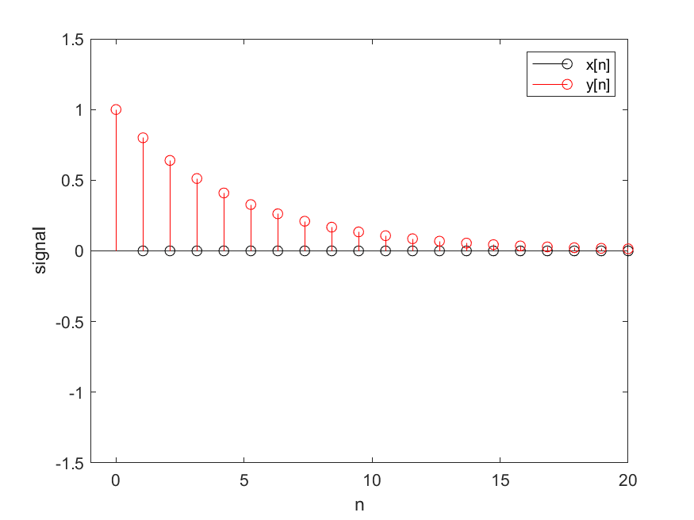

# Uppgift 7
```matlab
x = zeros(1,20);
x(1) = 1;

y = zeros(1,20);

a1 = -0.8;
N = length(x);
y(1) = x(1);

for n=2:N
    y(n) = x(n) - a1*y(n-1);
end
```

y[n] minskar med 20% varje steg, vilket är rimligt utav definitionen

# Uppgift 8

Resultatet hade kunnat förväntas, amplituderna adderas helt enkelt

# Uppgift 9
Det låter som att de högfrekventa signalerna filtrerats bort

# Uppgift 10
Det låter som att de lågfrekventa signalerna filtrerats bort

# Uppgift 11
Det blir ett högfrekvent "tjut", systemet är inte BIBO-stabilt när a>1 och de högfrekventa signalerna blir oändligt stora.
Alternativt så förstärks alla signaler, bara att de högfrekventa hörs mest

