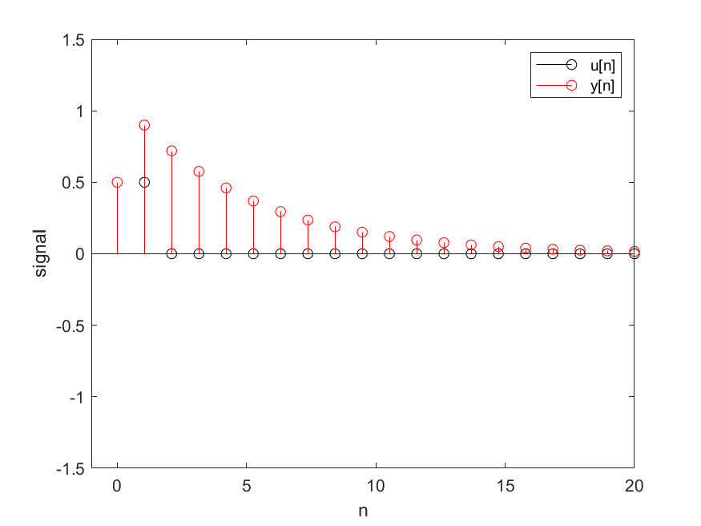

# uppgift 12

## kod:
```matlab
x = zeros(1,20); x(1) = 1; u = zeros(1,20); y = zeros(1,20);
b0 = 0.5; b1 = 0.5;
K = length(x);
u(1) = b0*x(1); % First sample, assuming x(0) = 0
for k=2:K % Remaining samples
    u(k) = b0*x(k) + b1*x(k-1);
end


a1 = -0.8;
N = length(u);
y(1) = u(1);% First sample, assuming x(0) = 0
for n=2:N % remaining samples
    y(n) = u(n) - a1*y(n-1);
end


l = linspace(0,20,20);
figure(1);
clf; hold on;
stem(l,u,'ko');
stem(l,y,'ro');
axis([-1 20 -1.5 1.5]);
box on;
xlabel('n'); ylabel('y[n]');
legend({'insignal', 'utsignal'}) 
```


# uppgift 13

det blir bara en förskjutning av svaret. Signalen är tidsinvariant.

## Kod:
```matlab
% uppg13.m
y1 = timevariantFunc(1);
y2 = timevariantFunc(2);

l = linspace(0,20,20);
figure(1);
clf; hold on;
stem(l,y1,'ko');
stem(l,y2,'ro');
axis([-1 20 -1.5 1.5]);
box on;
xlabel('n'); ylabel('y[n]');
legend({'y(x[\delta[n]]', 'y(x[\delta[n-1]]'})
````

```matlab
%timeinvariantFunc.m
function y = timevariantFunc(offset)
x = zeros(1,20); x(offset) = 1; u = zeros(1,20);
y = zeros(1,20);
b0 = 0.5; b1 = 0.5;
K = length(x);
u(1) = b0*x(1); % First sample, assuming x(0) = 0
for k=2:K % Remaining samples
    u(k) = b0*x(k) + b1*x(k-1);
end


a1 = -0.8;
N = length(u);
y(1) = u(1);% First sample, assuming x(0) = 0
for n=2:N % remaining samples
    y(n) = u(n) - a1*y(n-1);
end


end
```
# uppgift 14

Båda system ger samma utsignal (se 12_14 comparison Plot) slutsatsen vi kan dra är
att systemen är linjära. i kombination med uppgift 13 så är systemet LTI.

## Kod:
```Matlab
x = zeros(1,20); x(1) = 1; v = zeros(1,20);
y = zeros(1,20);


a1 = -0.8;
N = length(x);
v(1) = x(1);% First sample, assuming x(0) = 0
for n=2:N % remaining samples
    v(n) = x(n) - a1*v(n-1);
end

b0 = 0.5; b1 = 0.5;
K = length(v);
y(1) = b0*v(1); % First sample, assuming x(0) = 0
for k=2:K % Remaining samples
    y(k) = b0*v(k) + b1*v(k-1);
end


l = linspace(0,20,20);
figure(1);
clf; hold on;
stem(l,x,'ko');
stem(l,v,'ro');
stem(l,y,'go');
axis([-1 20 -1.5 1.5]);
box on;
xlabel('n'); ylabel('y[n]');
legend({'insignal', 'v[n]','utsignal'})
```


# uppgift 15

Vi kallar MA systemet för sys1, och AR systemet för sys2. Båda systemen LTI.

Därför är sys1[sys2[x]] = sys2[sys1[x]].

dvs systemen kan skrivas y[n] + a1y[n − 1] = b0x[n] + b1x[n − 1] 

därför ger uppgift 12 och 14 samma svar.

U[n] ≠ V[n]

# uppgift 16
 
